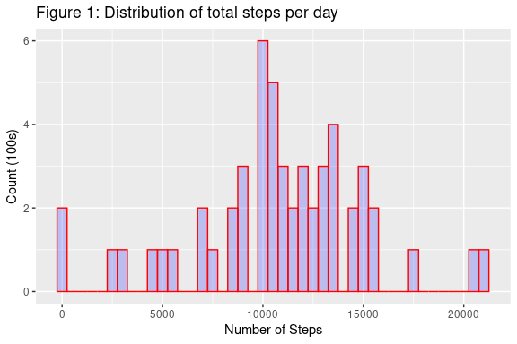
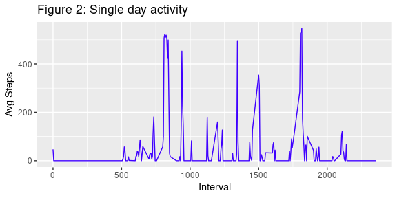
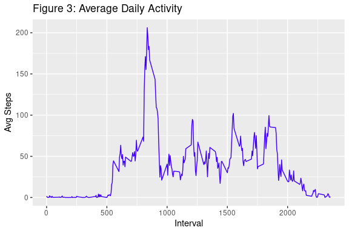
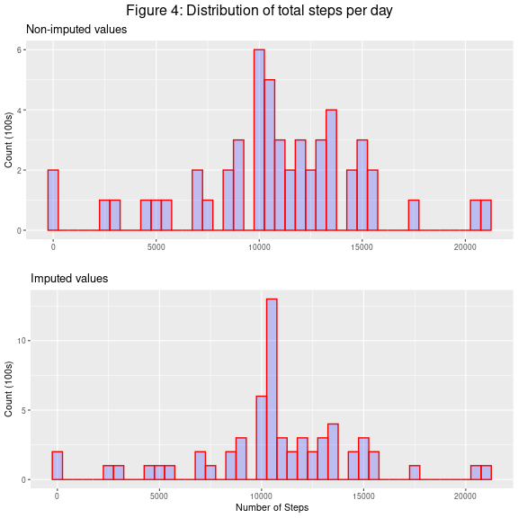
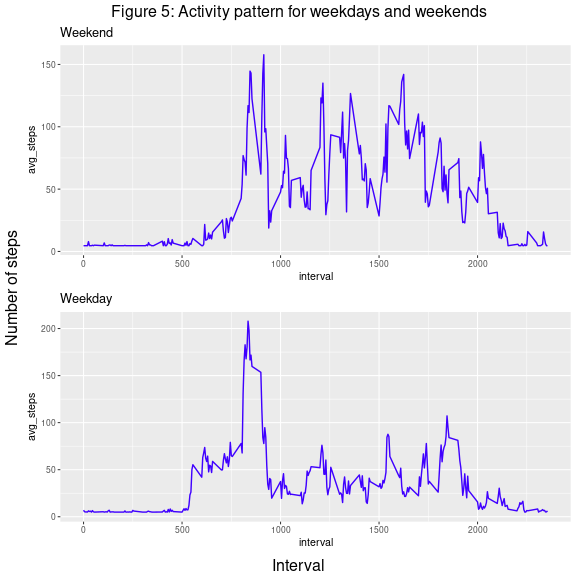

Report on Daily Activity
========================
Jim Coen
28 June 2021

Introduction
------------
__Goal__

This is a report on activity recorded from personal monitoring devices.  The goal is to produce descriptive statistics characterising the activity of one person over a two month period.

__Assumptions__

1. The monitor records physical activity in number of steps taken over a fixed interval (5 minutes).
2. The monitor stays attached to the person throughout the whole measurement period.

__Source Data__

The original data was obtained from the Reproducible Research course  repository and currated by Dr Roger Peng, John Hopkins University.

We are going to use the following libraries:


```r
library(data.table)
library(dplyr)
library(ggplot2)
library(grid)
library(gridExtra)
library(knitr)
```

and load the data obtained from Github:  
_github.com/rdpeng/RepData_PeerAssessment1_


```r
activity <- read.csv(file = "activity.csv",
                     stringsAsFactors = FALSE) %>% data.table
```

Exploratory Data Analysis
-------------------------


```r
activity[ , date := as.Date(date)]
summary(activity) %>% kable()
```


|   |    steps    |     date          |   interval  |
|:--|:------------|:------------------|:------------|
|   |Min.   :  0  |Min.   :2012-10-01 |Min.   :   0 |
|   |1st Qu.:  0  |1st Qu.:2012-10-16 |1st Qu.: 589 |
|   |Median :  0  |Median :2012-10-31 |Median :1178 |
|   |Mean   : 37  |Mean   :2012-10-31 |Mean   :1178 |
|   |3rd Qu.: 12  |3rd Qu.:2012-11-15 |3rd Qu.:1766 |
|   |Max.   :806  |Max.   :2012-11-30 |Max.   :2355 |
|   |NA's   :2304 |NA                 |NA           |

```r
n_obs <- nrow(activity)
days_u <- length(unique(activity$date))
```

* steps variable has 2304 NAs
* there are 17568 intervals recorded over 61 days
* there are 288 intervals in a single day
* Number of unique days is 61
 
Mean total number of steps taken per day
----------------------------------------
1. Histogram of the total number of steps taken per day
2. Mean and median total number of steps taken per day
 

```r
# take only complete cases
activity_cc <- activity[complete.cases(activity),]

act_by_day <- activity_cc[ , sum(steps), 
                        by = date] 
setnames(act_by_day, "V1", "day_steps")

steps_plot <- ggplot(act_by_day, aes(x = day_steps)) +
    geom_histogram(binwidth = 500,
                   col="red", 
                   fill="blue", 
                   alpha = .2) +
    labs(title="Figure 1: Distribution of total steps per day") +
    labs(x="Number of Steps", y="Count (100s)")
steps_plot
```

<!-- -->

```r
d_mean <- mean(act_by_day$day_steps, na.rm = TRUE) %>% 
    round()
d_median <- median(act_by_day$day_steps, na.rm = TRUE) %>% 
    round()
```

* The mean total number of steps per day is 10766
* The median total number of steps per day is 10765
* mean and median are almost the same.  This means that outliers do not influence the data

Average daily activity pattern
------------------------------

1. Identify pattern of activity for one specific day


```r
activity_day <- activity[date=="2012-10-04", ]
ggplot(activity_day, aes(x = interval, y = steps)) +
        geom_line(colour = "#3F00FF") +
    labs(title = "Figure 2: Single day activity",  
         x ="Interval",  y ="Avg Steps")
```

<!-- -->

2. Time series plot
    + Time series plot (type="l") of the 5-minute interval (x-axis) and the average number of steps taken, averaged across all days (y-axis).


```r
act_by_interval <- activity[, mean(steps, na.rm = TRUE), by = interval] %>% 
    setnames("V1", "avg_steps")
ggplot(act_by_interval, aes(interval, avg_steps)) +
    geom_line(colour = "#3F00FF") +
    labs(title = "Figure 3: Average Daily Activity",  
         x ="Interval",  y ="Avg Steps")
```

<!-- -->

* Activity starts to increase at about 8.30am 
    + 500 minutes / 60 minutes per hour
* There is high activity in the morning.
* Throughout the day, activity level varies.

3. Maximum average steps


```r
max_int <- which(act_by_interval$avg_steps == max(act_by_interval$avg_steps))
```
The 5-minute interval that contains the maximum average number of steps is 104

Imputing missing values
-----------------------

1. Identify days where no reading was taken i.e. days where step values are 'NA'


```r
activity[is.na(steps), date, by = date][, date]
```

```
[1] "2012-10-01" "2012-10-08" "2012-11-01" "2012-11-04" "2012-11-09"
[6] "2012-11-10" "2012-11-14" "2012-11-30"
```

```r
NA_rows <- activity[is.na(steps), .N]
```
* there was no reading taken on 8 out of 61 days
* leading to a total number of `NA_rows` entries with NAs (8 * 288)
* Since 288 is the number of intervals in a single day, this means that all intervals on each the 8 days above contain NA in the steps variable

__Strategy for filling in all of the missing values in the steps variable:__

1. Identify the 8 days that have no records of steps taken
2. Replace NAs in `steps` column with mean value and store in new dataset

```r
interval_mean <-  as.integer(
    mean(activity$steps, na.rm = TRUE) )
activity_i <- activity[ is.na(steps) == TRUE, steps := interval_mean ]
```
__Distributions__

1. Histogram of the total number of steps taken each day
2. Mean and median total number of steps taken per day. 


```r
act_by_day <- activity_i[ , sum(steps), by = date] 
setnames(act_by_day, "V1", "day_steps")

steps_imp_plot <- ggplot(act_by_day, aes(x = day_steps)) +
    geom_histogram(binwidth = 500,
                   col="red", 
                   fill="blue", 
                   alpha = .2) +
    labs(title = "Imputed values") +
    labs(x="Number of Steps", y="Count (100s)") + 
    theme_grey(base_size = 8)

d_mean_i <- mean(act_by_day$day_steps) %>% 
    round()
d_median_i <- median(act_by_day$day_steps) %>% 
    round()
```


```r
# When you make a call to par(), R sets your new options,
# but the return value from par() contains your old options
# old.par <- par(mfrow=c(2, 1))
# par(old.par)

steps_plot <- steps_plot +
    labs(title="Non-imputed values")  +
    labs(x="") +
    theme_grey(base_size = 8)

grid.arrange(steps_plot, steps_imp_plot, ncol = 1,
             top=textGrob("Figure 4: Distribution of total steps per day")) 
```

<!-- -->

```r
# to change text size of title
# , gp=gpar(fontsize=40, font = 2)))
```

* Difference in steps taken between dataset with NAs and  imputation with mean

Statistic | with NA  | Imputed
--------- | -------- | --------
mean      | 10766    |  10752
median    | 10765    |  10656 
  
* Impact of imputing missing data on the estimates of the total daily number of steps:  
There is little change in the mean.  However, the median for the imputed values does decrease, albiet by approximately one percentage point.  Also, imputation reduces the spread of values.  In addition, the mode shifts upwards so that the mean and mode coincide. This is the effect of the imputation method.

Differences betweek Weekdays and Weekends
-----------------------------------------

1. Create category (day_type) to identify weekdays (W) and weekend (S).
2. Calculate average number of steps over all intervals, grouped by "weekend" or "weekday"


3. Create time series plots of activity grouped by `day_type`


```r
w_end_pl <- ggplot(act_by_interval_end[day_type == "weekend"], aes(x = interval, avg_steps)) +
    geom_line(colour = "#3F00FF") +
    labs(title = "Weekend") +
    theme_grey(base_size = 8)

w_day_pl <- ggplot(act_by_interval_day[day_type == "weekday"], aes(x = interval, avg_steps)) +
    geom_line(colour = "#3F00FF") +
    labs(title = "Weekday") +
    theme_grey(base_size = 8)

grid.arrange( w_end_pl, w_day_pl, ncol = 1,
             top=textGrob("Figure 5: Activity pattern for weekdays and weekends"), 
             left = "Number of steps", 
             bottom = "Interval") 
```

<!-- -->

```r
# , gp=gpar(fontsize=10, font = 2)
```

4. Comparison of  mean and median values of average activity.


```r
wday_mean <- act_by_interval_day[, mean(avg_steps)]
wday_med <- act_by_interval_day[, median(avg_steps)]

wend_mean <- act_by_interval_end[, mean(avg_steps)]
wend_med <- act_by_interval_end[, median(avg_steps)]
```

Statistic | Weekday  | Weekend
--------- | -------- | --------
mean      |  35.56   |  42.32
median    |  25.71   |  32.66 

* Figure 5 shows that there is greater activity throughout the day at weekends.  On weekdays, the person is active in the morning intervals but this reduces for the rest of the day.
* Lower activity on a weekday is apparent in the median of 25.71 steps  On a weekend, there is a greater spread of activity so the mean value of 42.32 steps is more relevant.
* This pattern indicates an office worker who has active weekends and rushes to get to work on the weekday mornings.
